# CGRA 2020/2021

## Group T05G09

Filipe Pinto - up201907747

João Rodrigo - up201705110

## Project Notes

- We implement three functionalities: sea algae, launch rock to nest and MyAnimatedFish (others fishes animation).

## Screenshots

### 1 - MyFish

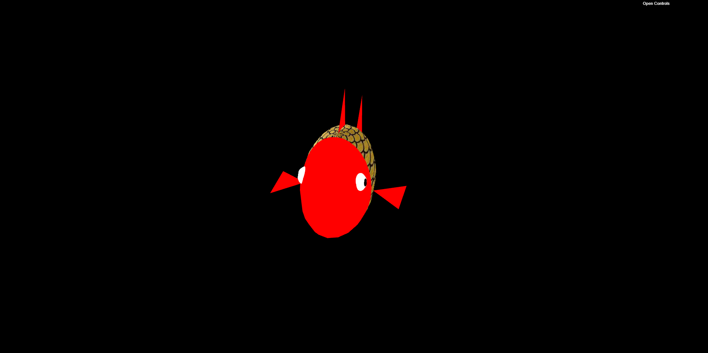

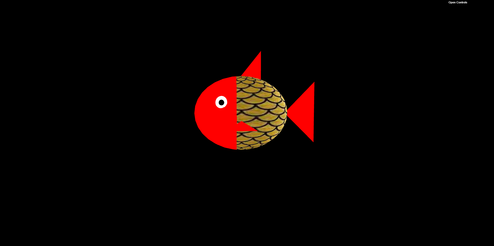

### 2 - Sea Floor

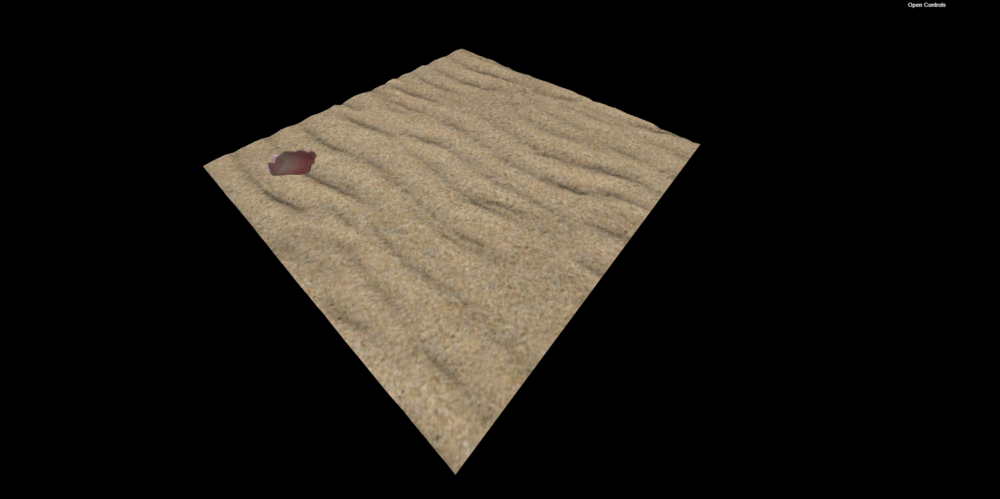

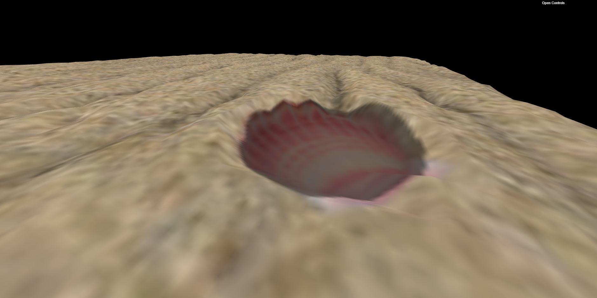

### 3 - Water

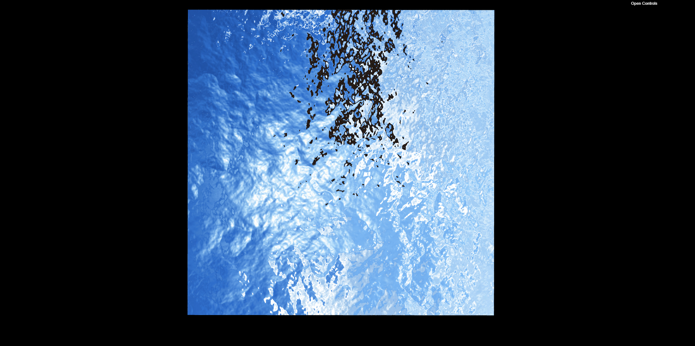

### 4 - MyRock

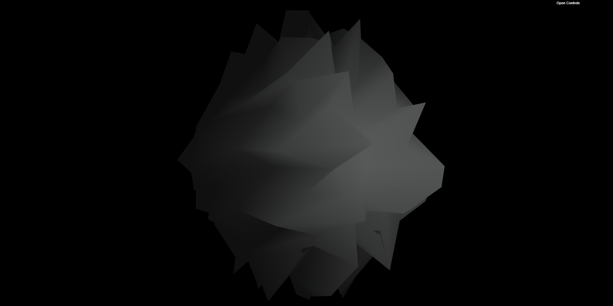

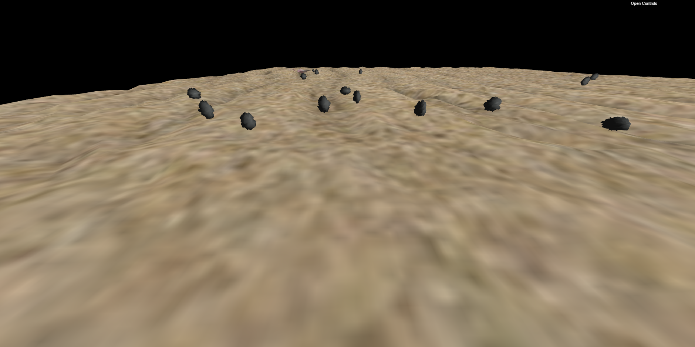

### 5 - MyPillar

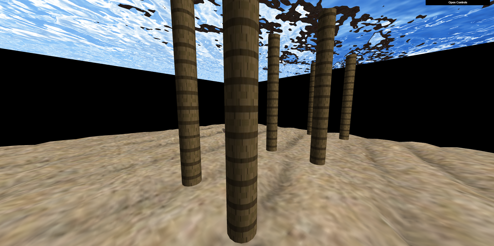

### 6 - Scene Elements

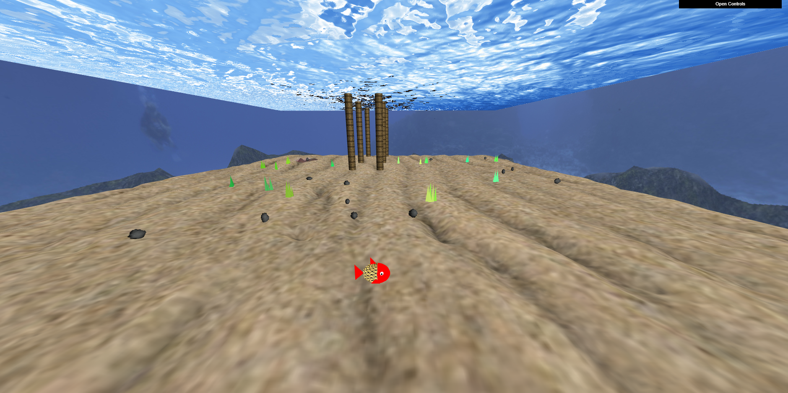

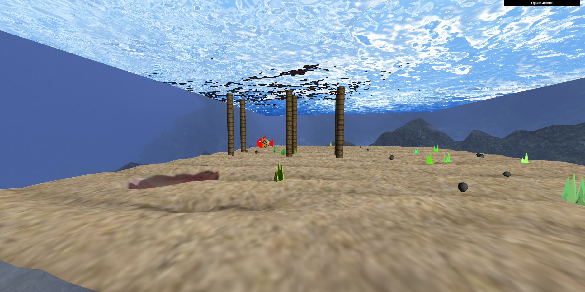

### 7 - Pick and Drop Rocks

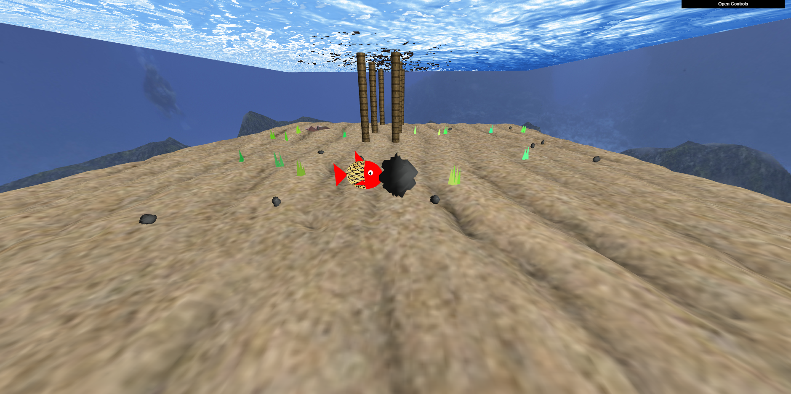

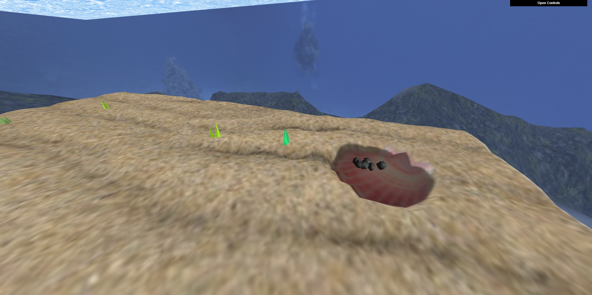

### 8 - Additional Features

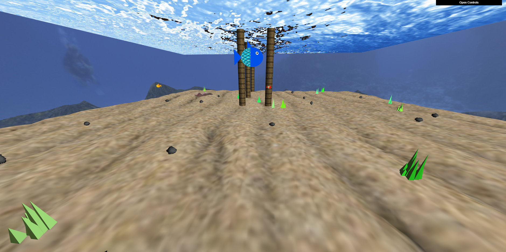

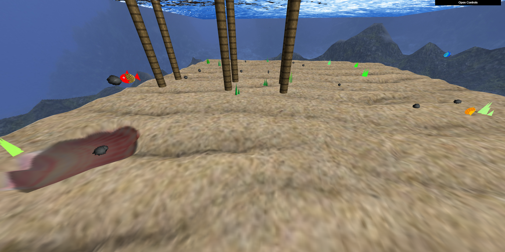

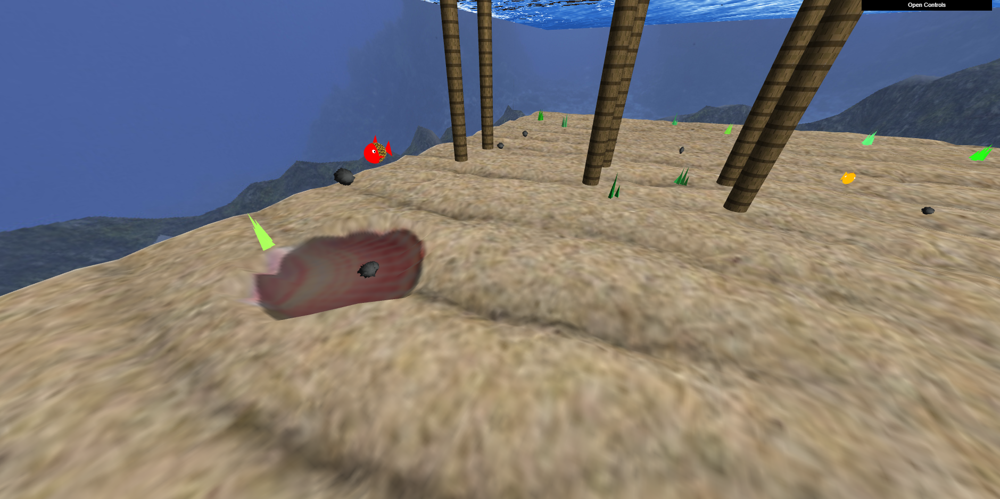

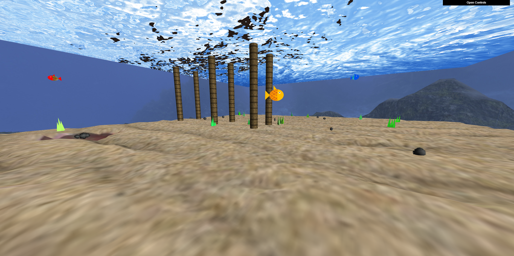

